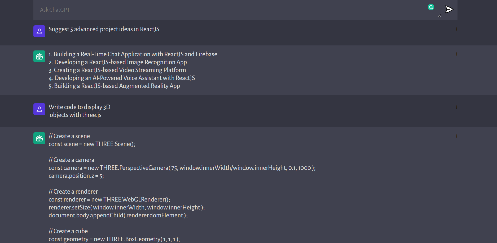

# Codex - OpenAI model that help you code
This project was bootstrapped with [Vite](https://github.com/vitejs/vite).  

Chat application allow communication with advanced GPT3 model API and help you code.

**Frontend**: ReactJS
**Backend**: NodeJS, OpenAI

***Important***: You should get OPENAI API key here ([openai.com/api](openai.com/api)) before start the development locally.

## Available Scripts

In the project directory, you can run:
***Server***:
### `npm run server`

Runs the server in the development mode. The server will listen on port 5000.\

***Client***:
### `npm run dev`

Runs the app in the development mode.\
Open [http://localhost:5173](http://localhost:5173) to view it in your browser.

The page will reload when you make changes.\
You may also see any lint errors in the console.

### `npm run preview`

Launches the Vite previewer in the interactive watch mode.\

### `npm run build`

Builds the app for production to the `build` folder.\
It correctly bundles React in production mode and optimizes the build for the best performance.

The build is minified and the filenames include the hashes.\
Your app is ready to be deployed!
