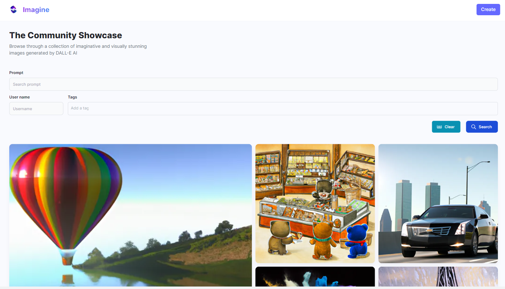

# Imagine



Imagine is an AI image generation application using DALL-E 2 API allows users to generate beautiful and surprising images based on specified prompt. Users can also share their images to the community showcases.

**Techologies**:

- [Vite](https://vitejs.dev/guide/) (react)
- [OpenAI](https://openai.com/api)
- [Express.js](https://expressjs.com/) (node)
- [Go Fiber](https://gofiber.io/)
- [MongoDB](https://mongodb.com/)
- [ImageKit](https://imagekit.io/)
- [SWR](https://swr.vercel.app/)

## Features

- [x] Generate image base on prompt
- [x] Generate image variant
- [x] Share generated images with others
- [x] Image tags
- [x] Image search
- [x] Download your favorite images

## Setup development

**Note**: The Go server currently has some bugs in generating image variant due to the package `go-openai`, I will fix it ASAP

Generally, Go server will be 5-10x faster than Node server, so if you don't need such features as generating image variant, simply go with Go.

### Setup environment variables

For the environment variables required, see `env.sample`. Each server will need its own `.env` file.

### Run the server

For Node.js server:

```bash
cd server && npm start
```

For Go server:

```bash
cd go-server
go mod tidy
go run main.go
```

The server will then listen on [http://localhost:8080](http://localhost:8080)

### Run the client

```bash
cd client
npm run dev
```

The client will be available at [http://localhost:5173](http://localhost:5173)
