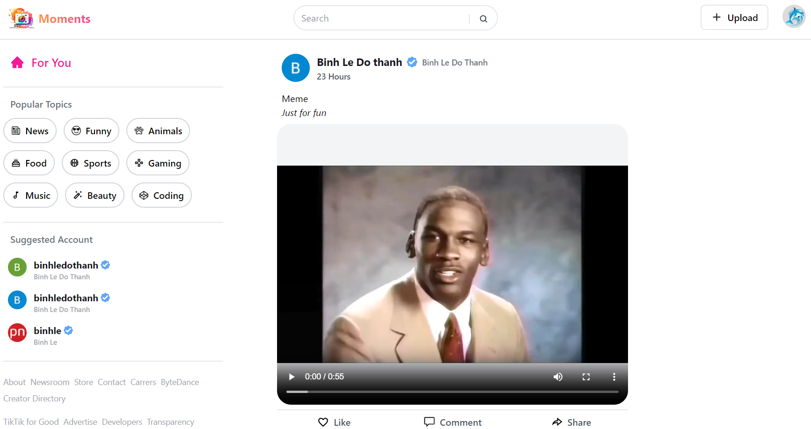
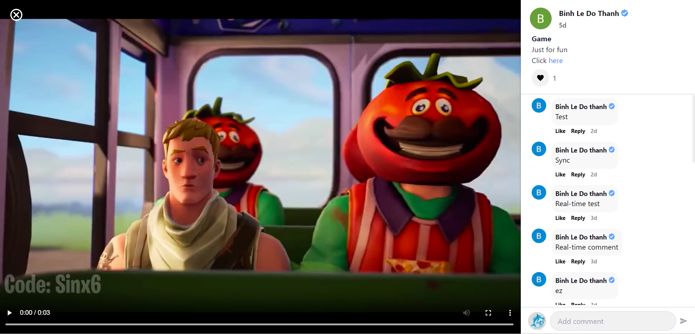
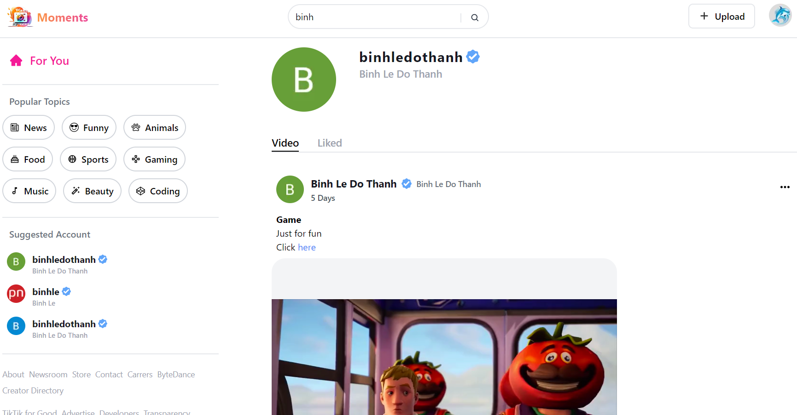
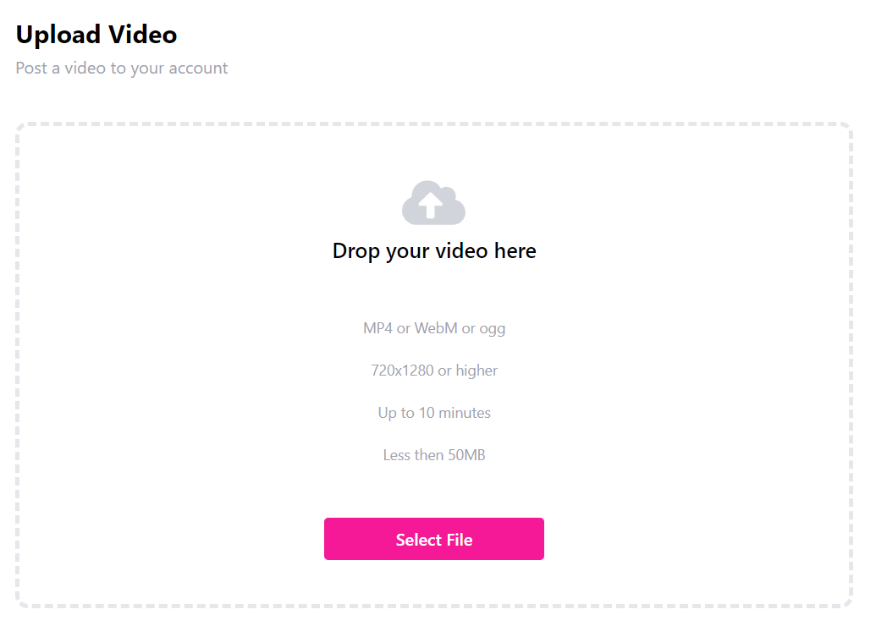
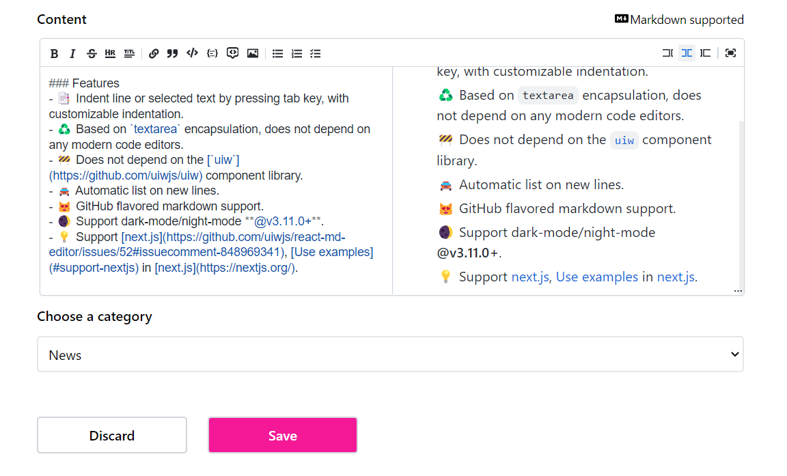
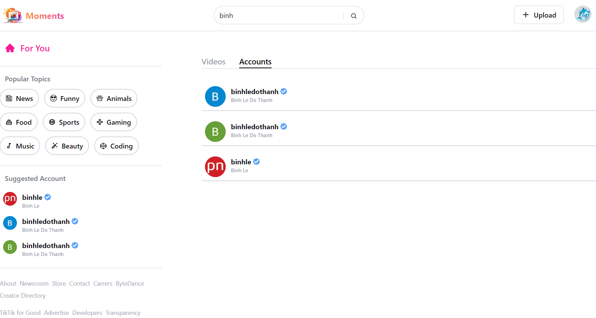
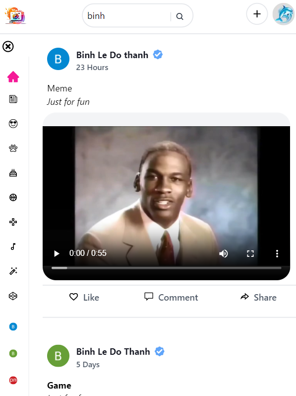
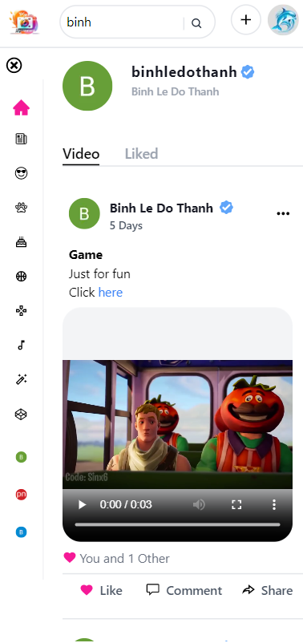

# Moments - Social video sharing platform



Moments is a social video sharing platform.

**Tech stacks**:

- Next.js, TypeScript, TailwinCSS, Zustand, next-auth, OAuth2, JWT
- Database: Sanity

**Features**:

- [x] Simple but secure login with Google/GitHub OAuth
- [x] Suggested users using suggest pool
- [x] Full security with next-auth session
- [x] Drag and drop video uploading
- [x] Upload new post
- [x] Update/Delete existing post (post's owner only)
- [x] Markdown supported for post content
- [x] Like functionality
- [x] View post comments
- [x] Real-time comment
- [x] Search functionality
- [x] View profile
- [x] Lazy loading
- [x] Infinite loading
- [x] Various APIs for fetching data

## Demo







**Mobile device**:




## APIs

`GET http://localhost:3000/api/hello`

`GET http://localhost:3000/api/comment/{id}`

`GET http://localhost:3000/api/discover/{topic}`

`GET http://localhost:3000/api/post`

`GET http://localhost:3000/api/post/{id}`

`GET http://localhost:3000/api/profile/{id}`

`GET http://localhost:3000/api/profile/liked/{id}`

`GET http://localhost:3000/api/profile/video/{id}`

`GET http://localhost:3000/api/search/{searchTerm}`

`GET http://localhost:3000/api/suggested-user`

## Getting Started

This is a [Next.js](https://nextjs.org/) project bootstrapped with [`create-next-app`](https://github.com/vercel/next.js/tree/canary/packages/create-next-app).

First, run the development server:

```bash
npm run dev
# or
yarn dev
# or
pnpm dev
```

Open [http://localhost:3000](http://localhost:3000) with your browser to see the result.

You can start editing the page by modifying `pages/index.tsx`. The page auto-updates as you edit the file.

[API routes](https://nextjs.org/docs/api-routes/introduction) can be accessed on [http://localhost:3000/api/hello](http://localhost:3000/api/hello). This endpoint can be edited in `pages/api/hello.ts`.

The `pages/api` directory is mapped to `/api/*`. Files in this directory are treated as [API routes](https://nextjs.org/docs/api-routes/introduction) instead of React pages.

This project uses [`next/font`](https://nextjs.org/docs/basic-features/font-optimization) to automatically optimize and load Inter, a custom Google Font.

## Learn More

To learn more about Next.js, take a look at the following resources:

- [Next.js Documentation](https://nextjs.org/docs) - learn about Next.js features and API.
- [Learn Next.js](https://nextjs.org/learn) - an interactive Next.js tutorial.

You can check out [the Next.js GitHub repository](https://github.com/vercel/next.js/) - your feedback and contributions are welcome!

## Deploy on Vercel

The easiest way to deploy your Next.js app is to use the [Vercel Platform](https://vercel.com/new?utm_medium=default-template&filter=next.js&utm_source=create-next-app&utm_campaign=create-next-app-readme) from the creators of Next.js.

Check out our [Next.js deployment documentation](https://nextjs.org/docs/deployment) for more details.
