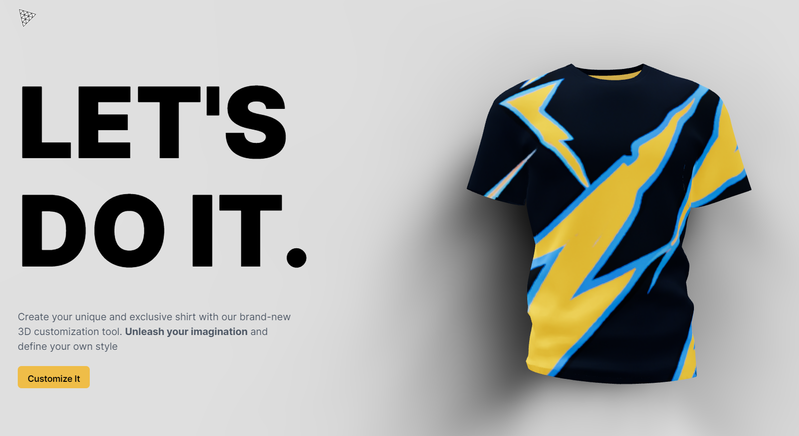

# T-Shirt customizer with threejs

[*Live demo*](https://shirt-t.vercel.app/)



This repository is a T-shirt customization application using `threejs` and DALL-E 2 API allows users to customize their T-shirt using their favorite color, logo, and pattern, or ask AI to generate stunning and attractive logos and patterns for their shirt.

**Techologies**:

- [Vite](https://vitejs.dev/guide/) (react)
- [OpenAI](https://openai.com/api)
- [Express.js](https://expressjs.com/) (node)
- [Go Fiber](https://gofiber.io/)
- [threejs](https://threejs.org/)

## Features

- [x] Customize shirt color
- [x] Customize logo
- [x] Customize pattern
- [x] Generate logo using DALL-E 2
- [x] Generate pattern using DALL-E 2
- [x] Save your customized shirt to png

## Setup development

### Setup environment variables

For the environment variables required, see `env.sample`. Each server will need its own `.env` file.

### Run the server

For Node.js server:

```bash
cd server 
npm install
npm start
```

For Go server:

```bash
cd go-server
go mod tidy
go run main.go
```

The server will then listen on [http://localhost:8080](http://localhost:8080)

### Run the client

```bash
cd client
npm install
npm run dev
```

The client will be available at [http://localhost:5173](http://localhost:5173)
